# Homework 4: Sorting Algorithms Performance Comparison
This repository contains a Python script that compares the performance of three sorting algorithms: Merge Sort, Insertion Sort, and Timsort (the built-in Python sorting algorithm). The script generates random arrays of different sizes and measures the time taken by each sorting algorithm to sort the arrays.

## Requirements
- Python 3.x

## Sorting Algorithms Implemented
- **Merge Sort**: A divide-and-conquer algorithm that divides the array into halves, sorts each half, and then merges the sorted halves.
- **Insertion Sort**: A simple sorting algorithm that builds the final sorted array one item at a time.
- **Timsort**: The built-in Python sorting algorithm, which is a hybrid sorting algorithm derived from merge sort and insertion sort.

## Results
The script outputs the time taken by each sorting algorithm for arrays of sizes 100, 1000, 5000, and 10000. The results show that Timsort is the fastest among the three algorithms for all tested array sizes, followed by Merge Sort, with Insertion Sort being the slowest, especially as the array size increases.

### Empirical Performance Data (Bar Chart)

```mermaid
%%{init: {'theme':'base'}}%%
xychart-beta
    title "Sorting Algorithms Performance Comparison - Empirical Data"
    x-axis ["100", "1000", "5000", "10000"]
    y-axis "Time (seconds)" 0 --> 2.0
    bar "Merge Sort" [0.000149, 0.001926, 0.012008, 0.025099]
    bar "Insertion Sort" [0.000578, 0.025094, 0.501577, 1.966369]
    bar "Timsort" [0.000008, 0.000075, 0.000527, 0.001013]
```

### Theoretical Complexity vs Empirical Data

```mermaid
%%{init: {'theme':'base'}}%%
xychart-beta
    title "Theoretical O(n) Complexity Curves vs Empirical Data"
    x-axis ["100", "1000", "5000", "10000"]
    y-axis "Normalized Time (relative units)" 0 --> 20000
    bar "Merge Sort (actual)" [1.49, 19.26, 120.08, 250.99]
    bar "Insertion Sort (actual)" [5.78, 250.94, 5015.77, 19663.69]
    bar "Timsort (actual)" [0.08, 0.75, 5.27, 10.13]
    line "Merge Sort O(n log n)" [0.66, 9.97, 61.44, 132.88]
    line "Insertion Sort O(n²)" [1, 100, 2500, 10000]
    line "Timsort O(n log n)" [0.66, 9.97, 61.44, 132.88]
```

## Analysis

### Time Complexity Overview

| Algorithm          | Best Case  | Average Case | Worst Case | Space Complexity |
|--------------------|------------|--------------|------------|------------------|
| **Merge Sort**     | O(n log n) | O(n log n)   | O(n log n) | O(n)             |
| **Insertion Sort** | O(n)       | O(n²)        | O(n²)      | O(1)             |
| **Timsort**        | O(n)       | O(n log n)   | O(n log n) | O(n)             |

### Empirical Observations

1. **Insertion Sort O(n²) Behavior**:
   - 100 → 1000 (10x): Time increased by ~43x (0.000578s → 0.025094s)
   - 1000 → 5000 (5x): Time increased by ~20x (0.025094s → 0.501577s)
   - 5000 → 10000 (2x): Time increased by ~3.9x (0.501577s → 1.966369s)
   - This clearly demonstrates O(n²) complexity as doubling the input quadruples the time

2. **Merge Sort O(n log n) Behavior**:
   - 100 → 1000 (10x): Time increased by ~12.9x (0.000149s → 0.001926s)
   - 1000 → 5000 (5x): Time increased by ~6.2x (0.001926s → 0.012008s)
   - 5000 → 10000 (2x): Time increased by ~2.1x (0.012008s → 0.025099s)
   - Growth rate matches O(n log n) complexity

3. **Timsort O(n log n) Optimized**:
   - Shows similar growth pattern to Merge Sort but with significantly lower constants
   - 100 → 1000 (10x): Time increased by ~9.4x
   - Demonstrates the efficiency of hybrid approach combining merge sort and insertion sort
   - Optimized for real-world data patterns (partially sorted arrays)

### Performance Comparison at Different Scales

- **Small arrays (n=100)**: 
  - Timsort: 0.000008s (baseline)
  - Merge Sort: 18.6x slower
  - Insertion Sort: 72.3x slower

- **Medium arrays (n=1000)**:
  - Timsort: 0.000075s (baseline)
  - Merge Sort: 25.7x slower
  - Insertion Sort: 334.6x slower

- **Large arrays (n=10000)**:
  - Timsort: 0.001013s (baseline)
  - Merge Sort: 24.8x slower
  - Insertion Sort: 1940.7x slower (nearly 2000x!)

## Conclusion

**Empirical data confirms theoretical complexity analysis:**

1. **Insertion Sort** demonstrates clear O(n²) behavior, making it impractical for large datasets. The performance degradation is dramatic as array size increases.

2. **Merge Sort** follows O(n log n) complexity consistently across all test sizes, maintaining good performance even with large arrays.

3. **Timsort** (Python's built-in) is the clear winner, achieving O(n log n) complexity with highly optimized constants. The hybrid approach combining:
   - Insertion sort for small subarrays (< 64 elements)
   - Merge sort for larger arrays
   - Recognition of existing order in data
   
   This makes Timsort significantly faster than pure implementations.

**Why use built-in Python sorting?**
- **Performance**: 20-2000x faster than custom implementations
- **Optimization**: Decades of engineering and edge case handling
- **Stability**: Maintains relative order of equal elements
- **Adaptivity**: Exploits existing order in real-world data

The empirical data strongly demonstrates why programmers should use built-in Python sorting algorithms (`sorted()` and `.sort()`) rather than implementing their own in most cases.
