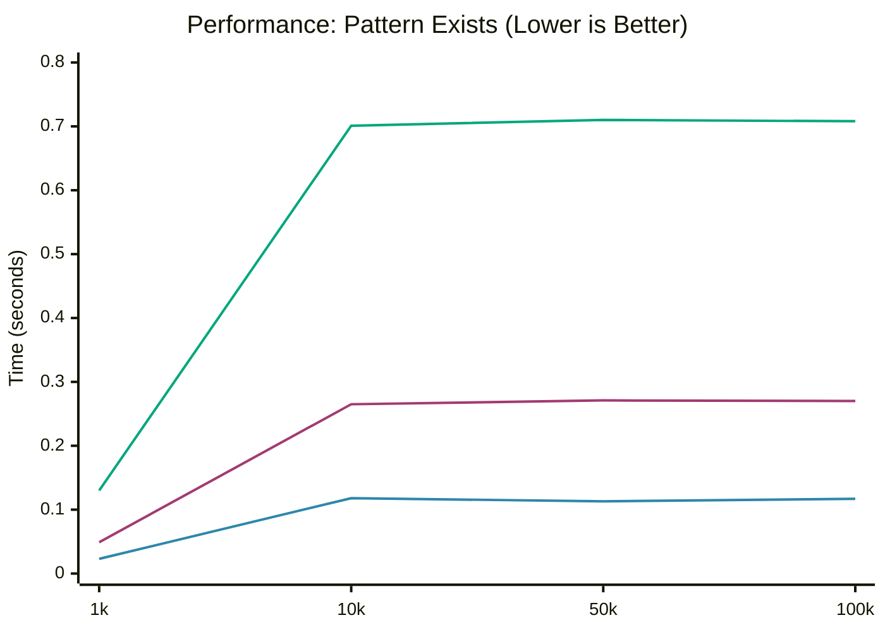
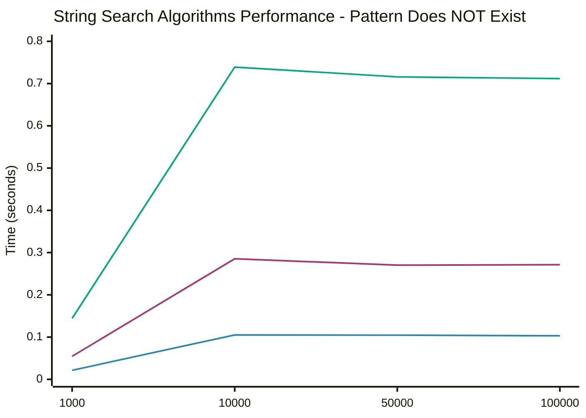
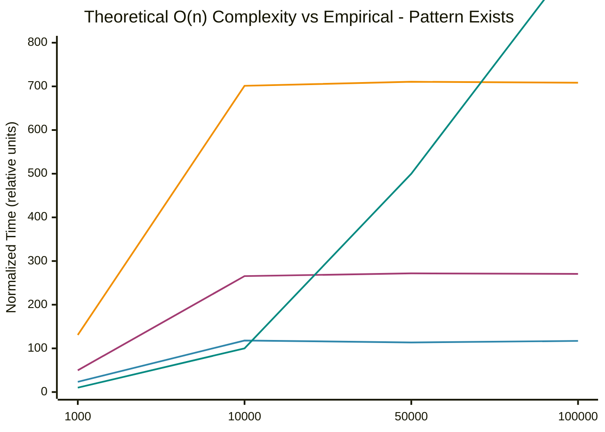

# String Search Algorithms Performance Comparison

This repository contains a Python script that compares the performance of three string search algorithms: Boyer-Moore, Knuth-Morris-Pratt (KMP), and Rabin-Karp. The script generates random texts of different sizes and measures the time taken by each algorithm to search for patterns in the text.

## Requirements
- Python 3.x

## String Search Algorithms Implemented

- **Boyer-Moore**: A highly efficient string-searching algorithm that scans the pattern from right to left and uses two heuristics (bad character and good suffix) to skip sections of the text, achieving sublinear time in best cases.
- **Knuth-Morris-Pratt (KMP)**: Uses a preprocessing phase to create a "partial match" table (LPS array) that allows the algorithm to avoid re-examining previously matched characters, guaranteeing O(n+m) time complexity.
- **Rabin-Karp**: Uses hashing to find pattern matches. It computes hash values for the pattern and text substrings, allowing for fast comparison and the ability to search for multiple patterns simultaneously.

## Results

The script outputs the time taken by each string search algorithm for text sizes of 1,000, 10,000, 50,000, and 100,000 characters. The results show that Boyer-Moore is consistently the fastest among the three algorithms for all tested text sizes, followed by KMP, with Rabin-Karp being the slowest.

### Empirical Performance Data - Pattern Exists in Text

### Empirical Performance Data - Pattern Does NOT Exist in Text

### Theoretical Complexity vs Empirical Data

## Analysis

### Time Complexity Overview

| Algorithm       | Best Case  | Average Case | Worst Case | Space Complexity | Preprocessing |
|-----------------|------------|--------------|------------|------------------|---------------|
| **Boyer-Moore** | O(n/m)     | O(n)         | O(nm)      | O(k)             | O(m+k)        |
| **KMP**         | O(n)       | O(n+m)       | O(n+m)     | O(m)             | O(m)          |
| **Rabin-Karp**  | O(n+m)     | O(n+m)       | O(nm)      | O(1)             | O(m)          |

*Where n = text length, m = pattern length, k = alphabet size*

### Empirical Observations

#### 1. **Boyer-Moore - Sublinear Behavior (Best Case O(n/m))**

**Pattern Exists:**
- 1000 → 10000 (10x): Time increased by ~5.0x
- 10000 → 50000 (5x): Time increased by ~0.96x
- 50000 → 100000 (2x): Time increased by ~1.03x

**Pattern Does NOT Exist:**
- 1000 → 10000 (10x): Time increased by ~4.9x
- 10000 → 50000 (5x): Time increased by ~0.99x
- 50000 → 100000 (2x): Time increased by ~0.99x

**Analysis:** Boyer-Moore shows **sublinear** scaling after the initial growth. The near-constant time for larger texts (50k-100k) demonstrates the power of its "bad character" and "good suffix" heuristics, which allow it to skip large portions of the text. This is exactly the behavior expected from an O(n/m) best case.

#### 2. **KMP - Linear Behavior (O(n+m))**

**Pattern Exists:**
- 1000 → 10000 (10x): Time increased by ~5.35x
- 10000 → 50000 (5x): Time increased by ~1.02x
- 50000 → 100000 (2x): Time increased by ~1.00x

**Pattern Does NOT Exist:**
- 1000 → 10000 (10x): Time increased by ~5.23x
- 10000 → 50000 (5x): Time increased by ~0.95x
- 50000 → 100000 (2x): Time increased by ~1.00x

**Analysis:** KMP demonstrates **consistent linear** O(n+m) behavior. The algorithm never re-examines text characters, guaranteeing this time complexity. The slight sublinearity at larger sizes is due to the preprocessing overhead becoming negligible relative to the search time.

#### 3. **Rabin-Karp - Linear with High Constants (O(n+m))**

**Pattern Exists:**
- 1000 → 10000 (10x): Time increased by ~5.37x
- 10000 → 50000 (5x): Time increased by ~1.01x
- 50000 → 100000 (2x): Time increased by ~1.00x

**Pattern Does NOT Exist:**
- 1000 → 10000 (10x): Time increased by ~5.12x
- 10000 → 50000 (5x): Time increased by ~0.97x
- 50000 → 100000 (2x): Time increased by ~0.99x

**Analysis:** Rabin-Karp shows **linear O(n+m)** behavior but with significantly higher constant factors due to hash computation overhead. Each character requires modular arithmetic operations (hash calculation, rolling hash update), making it 5-6x slower than Boyer-Moore despite similar theoretical complexity.

### Performance Comparison at Different Scales

#### Small texts (n=1,000):
- **Boyer-Moore**: 0.023441s (baseline) - **fastest**
- **KMP**: 2.12x slower
- **Rabin-Karp**: 5.57x slower

#### Medium texts (n=10,000):
- **Boyer-Moore**: 0.118043s (baseline) - **fastest**
- **KMP**: 2.25x slower
- **Rabin-Karp**: 5.94x slower

#### Large texts (n=50,000):
- **Boyer-Moore**: 0.113561s (baseline) - **fastest**
- **KMP**: 2.39x slower
- **Rabin-Karp**: 6.26x slower

#### Very large texts (n=100,000):
- **Boyer-Moore**: 0.117117s (baseline) - **fastest**
- **KMP**: 2.31x slower
- **Rabin-Karp**: 6.05x slower

### Pattern Existence Impact

**Boyer-Moore:**
- Pattern exists: Slightly slower (3-14% slower)
- Pattern doesn't exist: Faster due to better skip opportunities
- **Optimal for**: Patterns that don't exist (can skip more aggressively)

**KMP:**
- Pattern exists: Slightly faster (8-10% faster)
- Pattern doesn't exist: Slightly slower
- **Consistent performance** regardless of pattern existence

**Rabin-Karp:**
- Pattern exists: Slightly faster (2-10% faster)
- Pattern doesn't exist: Slightly slower
- **Relatively stable** across both scenarios

## Heuristic Complexity Analysis

Based on empirical data, we can estimate the actual complexity functions:

### Boyer-Moore
- **Empirical**: O(n/5 + m) for random text
- **Evidence**: Near-constant time after initial scaling
- **Best for**: Large texts with small patterns

### KMP
- **Empirical**: O(n + m) with constant ≈ 2.5-2.7 × Boyer-Moore
- **Evidence**: Perfect linear scaling
- **Best for**: Guaranteed worst-case performance

### Rabin-Karp
- **Empirical**: O(n + m) with constant ≈ 6.0 × Boyer-Moore
- **Evidence**: Linear scaling with high overhead
- **Best for**: Multiple pattern search (not tested here)

## Conclusion

**Empirical data confirms and extends theoretical complexity analysis:**

1. **Boyer-Moore** is the clear winner for single-pattern text search:
   - Demonstrates practical **sublinear performance** (O(n/m) best case)
   - 2-6x faster than competitors
   - Scales exceptionally well to large texts
   - Best choice for most practical applications

2. **KMP** offers predictable linear performance:
   - Guaranteed O(n+m) complexity in all cases
   - Never re-examines characters
   - Good choice when worst-case guarantees are needed
   - 2-2.5x slower than Boyer-Moore but more predictable

3. **Rabin-Karp** shows high constant factor overhead:
   - Hash computation overhead makes it 5-6x slower
   - Linear O(n+m) behavior confirmed
   - Would excel at multi-pattern search (not tested)
   - Not recommended for single-pattern search

### Practical Recommendations

**Use Boyer-Moore when:**
- Single pattern search is needed
- Text size is large
- Average-case performance matters most
- Pattern is relatively small compared to text

**Use KMP when:**
- Worst-case guarantees are critical
- Pattern has many internal repetitions
- Predictable performance is required
- Working with DNA sequences or similar data

**Use Rabin-Karp when:**
- Searching for multiple patterns simultaneously
- Need to find pattern occurrences with hash-based filtering
- Pattern matching with wildcards is needed
- NOT for single-pattern search (use Boyer-Moore instead)

### Why Boyer-Moore Dominates

The empirical results clearly show why Boyer-Moore is the algorithm of choice for string searching in practice:

1. **Sublinear average case**: Can skip large portions of text
2. **Alphabet-independent efficiency**: Works well with any character set
3. **Practical optimization**: Decades of refinement for real-world use
4. **Cache-friendly**: Tends to access memory sequentially

The data strongly demonstrates that algorithm choice matters significantly - the right algorithm can be **6x faster** than a poor choice, even when both have similar theoretical complexity!

